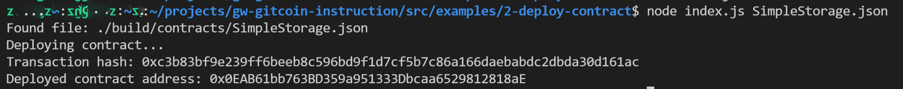

1. A screenshot of the console output immediately after you have successfully deployed a smart contract.



2. The transaction hash from the contract deployment (in text format).

```
0xc3b83bf9e239ff6beeb8c596bd9f1d7cf5b7c86a166daebabdc2dbda30d161ac
```

3. The deployed contract address from the contract deployment (in text format).

```
0x0EAB61bb763BD359a951333Dbcaa6529812818aE
```