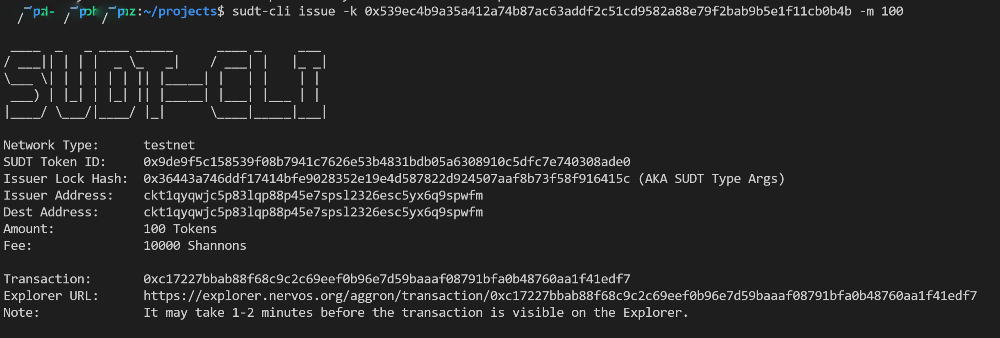

1. A link to the Layer 1 address you funded on the Testnet Explorer.

```
https://explorer.nervos.org/aggron/address/ckt1qyqwjc5p83lqp88p45e7spsl2326esc5yx6q9spwfm
```

2. A screenshot of the console output immediately after using sudt-cli to create your SUDT tokens on Layer 1.



3. A link to the transaction ID created by sudt-cli on the Testnet Explorer.

```
https://explorer.nervos.org/aggron/transaction/0xc17227bbab88f68c9c2c69eef0b96e7d59baaaf08791bfa0b48760aa1f41edf7
```
4. A screenshot of the console output immediately after you have successfully submitted a deposit to Layer 2 using the account-cli tool.


5. The SUDT ID from the console output after executing the deposit script (in text format).

```
942
```