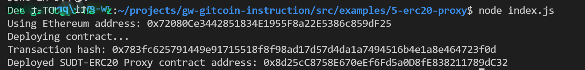
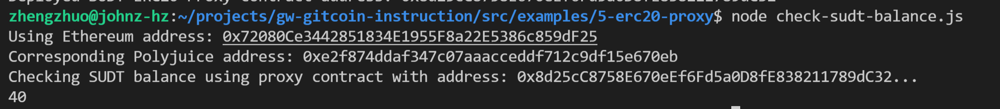

1. A screenshot of the console output immediately after deploying smart contract.



2. The address of the ERC20 Proxy Contract you deployed (in text format).

```
0x8d25cC8758E670eEf6Fd5a0D8fE838211789dC32
```

3. A screenshot of the console output immediately after checking your SUDT balance.



4. The Ethereum address that was checked (in text format).
```
0x72080Ce3442851834E1955F8a22E5386c859dF25
```