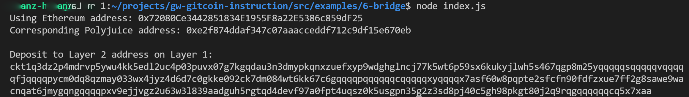

1. A screenshot of the console output immediately after you have successfully generated your Deposit Receiver Address.



2. Your Deposit Receiver Address (in text format).

```
ckt1q3dz2p4mdrvp5ywu4kk5edl2uc4p03puvx07g7kgqdau3n3dmypkqnxzuefxyp9wdghglncj77k5wt6p59sx6kukyjlwh5s467qgp8m25yqqqqqsqqqqqvqqqqqfjqqqqpycm0dq8qzmay033wx4jyz4d6d7c0gkke092ck7dm084wt6kk67c6gqqqqpqqqqqqcqqqqqxyqqqqx7asf60w8pqpte2sfcfn90fdfzxue7ff2g8sawe9wacnqat6jmygqngqqqqpxv9ejjvgz2u63w3l839aadguh5rgtqd4devf97a0fpt4uqsz0k5usgpn35g2z3sd8pj40c5gh98pkgt80j2q9rqgqqqqqqcq5x7xaa
```

3. The Ethereum address used to generate the Deposit Receiver Address (in text format).

```
0x72080Ce3442851834E1955F8a22E5386c859dF25
```

4. A link to the Etherscan explorer for the successful Force Bridge transaction. This can be found on Force Bridge under History→Succeed.

```
https://rinkeby.etherscan.io/tx/0xaf41120f7e0a893c45e0024573e208c44e55837cd54d4d64f3d82ecf665ab1ac
```

5. A link to the Nervos explorer for the successful Force bridge transaction. This can be found on Force Bridge under History→Succeed.

```
https://explorer.nervos.org/aggron/transaction/0xe7874da595968411d8eda6ee5b980824c57b1059811a8ec5dc3f977c835803d6
```